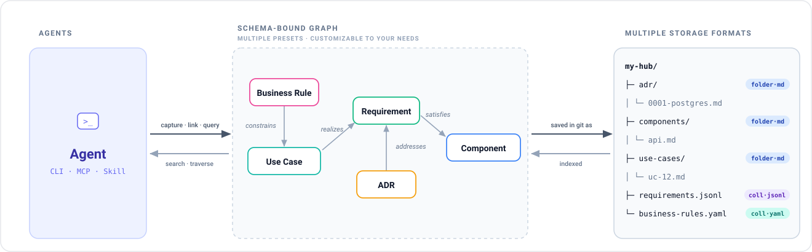

# khub


**Schema-bound, agent-facing context management.**

khub gives an AI agent typed, validated, queryable context (structured memory it can navigate and write back to) instead of unstructured documents stuffed into a context window.



One generic engine: entities live in git as Markdown with YAML frontmatter (the default), as `.json`/`.yaml` documents, or as rows of a single-file collection, per-type schema config. The khub schema is the contract: types, attributes, and legal relations, authored in YAML and resolved in memory. A Go core provides schema-validated CRUD and graph queries; a generic `khub` CLI and a Claude Code skill are thin, schema-driven surfaces over it. It ships as one static binary — no runtime to install. The graph is a projection rebuilt from the Markdown on demand; no database is ever the source of truth.

Built on top of the [Open Knowledge Format (OKF)](https://github.com/GoogleCloudPlatform/knowledge-catalog/blob/main/okf/SPEC.md). khub's Markdown entities are OKF concepts; on top, khub adds a typed schema, a graph, and the serialization formats and collections OKF lacks. Any workspace projects to a conformant OKF bundle.

**The schema is the operational setup.** It configures what a given hub is *for*. Canonical ontology presets, one per domain (building and maintaining a system, consulting, research, operations), are the reusable IP. Each engagement gets its own repo seeded from a preset, where agents and humans co-author entities and extend the schema as the work demands.

## What it does today

- **Author** — `add` / `get` / `edit` / `link` / `unlink` / `remove`: schema-validated writes, referential integrity hard-fails, capture never blocked, minimal-diff round-trips. A templated type's `add` seeds the body from its template (`--no-template` opts out).
- **Find** — `query` (frontmatter + edge filters), `search` (BM25 full-text over titles, bodies, and fields: FTS5, built in-memory per call, never stale), `neighbors` / `impact` / `history` (graph walks).
- **Gate** — `validate` (per-entity well-formedness, including body structure against the type's template: required section headings as an ordered subsequence) and `check` (graph-wide completeness, dangling edges, strays, cycles, missing required singletons; orphans informational unless `--strict`); `stale` reads git at entity altitude, row-accurate even inside collections.
- **Project** — `reindex` (OKF `index.md`), `viz` (Cytoscape HTML), `backfill` (git-derived dates and scaffolding).
- **Store** — per-type `layout` (file / folder / collection / singleton) × `format` (md / json / yaml; collections take json / jsonl / yaml). A singleton is one fixed file whose slug is the type name (`khub get prd`). Non-md entities carry prose in a reserved `body` field; collection writes are lock-serialized and crash-atomic.
- **Scaffold** — presets are directories (`<name>/schema.yaml` + `templates/*.yaml`); `khub init` flattens both into `.khub/` and creates every missing md singleton from its template (creations only — an existing file is never touched).
- **Wire** — `wire`: link the schema into a project's agent files. Bare `wire` updates whichever of `CLAUDE.md` / `AGENTS.md` exist; `--target claude|agents|both` creates one. `CLAUDE.md` gets a `@.khub/schema.yaml` import, `AGENTS.md` a schema pointer, both with the command surface — so an agent reasons in the ontology with or without the CLI.

Full command surface and JSON contracts: [`docs/cli.md`](docs/cli.md). Feature history: [`CHANGELOG.md`](CHANGELOG.md). All documentation: [`docs/`](docs/).

## Quickstart

khub is a single static binary — no runtime, no interpreter. Install it, then seed a workspace from a preset:

```bash
curl -fsSL https://khub.end.game/install.sh | sh   # ~/.local/bin/khub; or build: go build -o khub ./cmd/khub
khub init firm-ops ./my-hub          # scaffold .khub/ (+ templates, singletons), wire agent files
cd my-hub
khub install-skills                  # copy the agent skills in (offline, no Node)
```

Author entities. Referential integrity hard-fails on write (a relation to a missing target is rejected), but a missing field never blocks capture:

```bash
khub add client  --name "Acme Corp" --industry manufacturing
khub add person  --name "Dana Lee"  --role partner
khub add project --title "Acme Diagnostic" --client acme-corp --owner dana-lee
```

Then walk the graph and gate it:

```bash
khub query --type project        # → project/acme-diagnostic, with orphan/stale flags
khub neighbors acme-diagnostic   # → its client and owner edges
khub check                       # graph-wide: relations resolve, nothing dangling → passed
```

Every read command takes `--format json` for an agent and prints a Rich table for a human.

**Headless by design.** Every input is a flag; a missing one is a usage error, never a prompt. khub carried an interactive wizard through 0.8.0 behind a gate that switched it off for agents, pipes, and CI — dead weight on exactly the invocation khub is built for. Removed in 0.9.0, along with the `--agent` flag that disabled it.

## Why not a folder of Markdown, a database, or a RAG store?

| Instead of… | What you give up |
|---|---|
| A folder of Markdown / Obsidian | No schema, no typed relations, no integrity gate: nothing rejects a broken or dangling reference, and an agent can't walk the graph. |
| A database | Truth stops being git — no diff, no PR review, no plain-text portability — and the schema lives in migrations instead of one readable file. |
| A vector / RAG store | Retrieval is fuzzy and lossy: no exact relations to traverse, no completeness gate, and writes don't round-trip. |

khub keeps git as the source of truth, then adds a typed schema and a derived graph on top: exact reads, validated writes, and an integrity gate an agent can rely on.

## Presets

A preset is a canonical ontology for one domain — a directory holding its `schema.yaml` (entity types, attributes, legal relations) and optional body `templates/`. `khub init` merges `core.yaml` (the `base` block every entity carries: `type`, `created`/`updated`, `tags`, the OKF fields, the `any → any` edges) with the named preset into an engagement's `.khub/schema.yaml`, which agents and humans then extend as the work demands.

**Three presets ship today:**

- **`firm-ops`** — the HQ operations ontology (client, project, person, opportunity, meeting, and more); see [`docs/firm-ops-preset.md`](docs/firm-ops-preset.md).
- **`build-hub`** — the knowledge hub of a build project: 20 types across `knowledge/{product,architecture}` + `specs/`; see [`docs/build-hub-preset.md`](docs/build-hub-preset.md).
- **`build-lite`** — `build-hub` cut to necessity: 6 types for a small project, with a documented add-back ladder to grow into the full preset; see [`docs/build-lite-preset.md`](docs/build-lite-preset.md). New to khub? Start with [`docs/getting-started.md`](docs/getting-started.md).

## Agent skills

khub ships two skills: `khub` (the read and write verbs) and `setup` (install the CLI, set up a project). They work in Claude Code, opencode, Cursor, Codex, Gemini CLI, and any other agent that reads a `SKILL.md`.

**Option 1 — the CLI, then its skills.** A file copy out of the binary itself: offline, no Node, safe to re-run.

```bash
curl -fsSL https://khub.end.game/install.sh | sh
khub install-skills
```

That writes both skills into `.claude/skills/`, `.agents/skills/`, and `.opencode/skills/`, and gitignores them (they are reproducible from the CLI). Narrow it with `--target claude|agents|opencode` or `--skill khub|setup`; `--global` installs into your home directories instead, once per machine; `--dry-run` shows the writes first.

**Option 2 — let an agent do it.** Installs the `setup` skill, which tells the agent how to install the CLI and set up the project. Needs Node, network, and read access to this repo:

```bash
npx skills add git@github.com:endgame-build/khub.git -s setup
```

Use option 2 on a machine with no khub yet; option 1 is what you re-run afterwards.

**Status:** v1 engine shipped and proven on a live corpus (the firm-hq cutover: the incumbent scripts retired). Design rationale in [`docs/design-memo.md`](docs/design-memo.md); the collections row model in [`docs/collections-design.md`](docs/collections-design.md).

## License

MIT — see [`LICENSE`](LICENSE).
